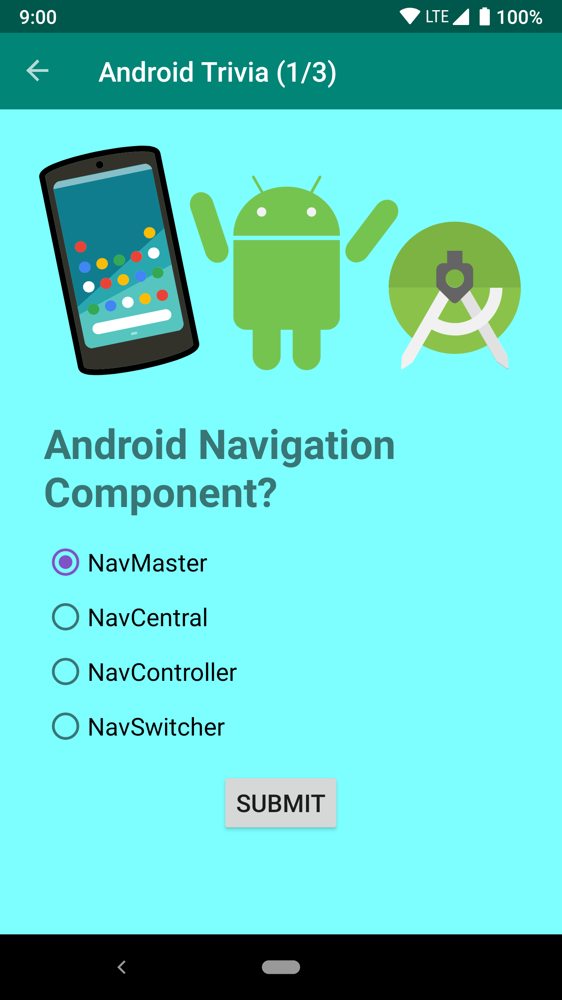

# Navigation

This is the toy app for lesson 3 of the [Android App Development in Kotlin course on Udacity](https://www.udacity.com/course/developing-android-apps-with-kotlin--ud9012).

## Android Trivia 

Since students haven't yet learned about saving data or the Android lifecycle, it tries to eliminate bugs caused by configuration changes. 

  
  <h3 align="center">About Me</h3>

  

    A trivia game 
   on Android.
     
     
     
    

 

### Table of contents

**1 [About the App](#about-the-app)** 
**2 [General Preview](##general-preview)** 
**3 [Technical](#technical)** 
**4 [Work in Progress](#work-in-progress)** 
**5 [Contributing](#contributing)** 
**6 [License](#license)** 
**7 [Versions](#versions)** 
**8 [Contributers](#contributers)** 

:point_down: :point_down: :point_down: :point_down: :point_down:

# About the app

The Android Trivia application is an application that asks the user trivia questions about Android development.  It makes use of the Navigation component within Jetpack to move the user between different screens.  Each screen is implemented as a Fragment.
The app navigates using buttons, the Action Bar, and the Navigation Drawer.

## General Preview

#### Screenshots of the app

## Technical

## Permissions

* Any permissions needed by the app i.e:

1. Internet
2. Browse phone

#### Running the project
You can:

    a. clone the project and compile it yourself in android studio(Most up to date)
    b. Run the already compiled version on the(the proect comes with an apk folderwith various apk versions).

### TECHNICAL

#### How to use

**1. Required to run project:**
       ` - To run this project use Android studio 3.* and later. It will be less messy.
         - Gradle version used: gradle 4.0. You can use multiple gradle versions vby having them stored offline. [You can read this to set it up.](www.sth)
        `

**2. Clone this repository :**
 
         `https://github.com/kevinmainairungu/andfun-kotlin-android-trivia#about-the-app`
         
**3. open Project in Android Studio

**4. Build Project**

**5. Incase of an eror when building project, update your gradle version, Build Tools download**

#### Dependencies

## To Do List

- [x] Adding a findViewById resource instance for the images
- [ ] SplashScreen
- [x] Binding data
- [x] Updating the App to gradle 5.x
- [X] Button for the 'done' functionality
- [ ] Creating additional activities for more details
- [ ] Add recycler view
- [ ] Link to projects

#### CONTRIBUTING
### Assets
* Credit to artists(music,images,gifs...)

### List of the Contributors on GitHub
* [Contributors](https://github.com/kevinmainairungu/andfun-kotlin-android-trivia#about-the-app/graphs/contributors)

### Want to contribute?
I would/ We'd love to have your help in making  **{this app (About me)}** better. The project is still very incomplete, but if there's an issue you'd like to see addressed sooner rather than later, let me(/us) know. 

Before you contribute though read the contributing guide here: [COntributing.md](https://github.com/kevinmainairungu/andfun-kotlin-android-trivia#about-the-app/contributing.md)

For any concerns, please open an [issue](https://github.com/kevinmainairungu/andfun-kotlin-android-trivia#about-the-app/issues), or JUST, [fork the project and send a pull request{edit this}](https://github.com/kevinmainairungu/andfun-kotlin-android-trivia#about-the-app/pulls). 

## License 
* see [LICENSE](https://github.com/kevinmainairungu/andfun-kotlin-android-trivia#about-the-app/blob/master/LICENSE) file

## Versions 
* Version X.Y  DATE 12/2/2019

## Contributers
For personal feedback or questions feel free to contact me via the mail address, which is mentioned on my [Github profile](link (https://github.com/kevinmainairungu). If you have found any bugs or want to post a feature request please use the [bugtracker](https://github.com/kevinmainairungu/AboutMe/issues) to report them.

#### Developer/Company
* Homepage:  
* e-mail: 
* Twitter: [@maina_irungu_](https://twitter.com/maina_irungu_ "maina_irungu_")
* other communication channels i.e Social Media, Forum etc

https://contributors-img.firebaseapp.com/

If its open source:

  

Licence is MIT:

